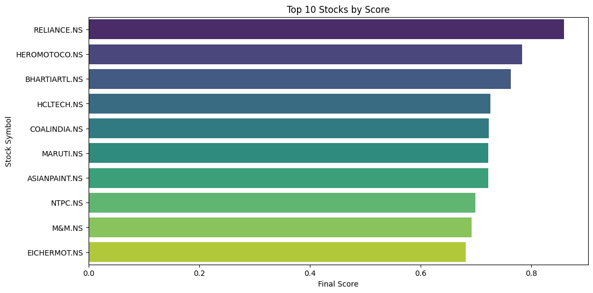
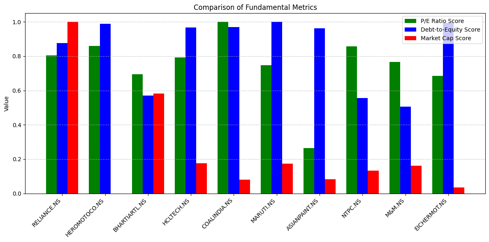
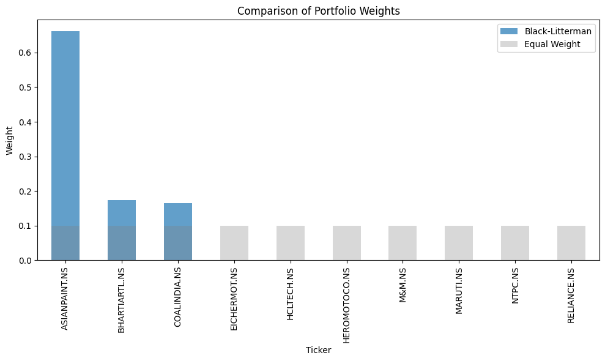
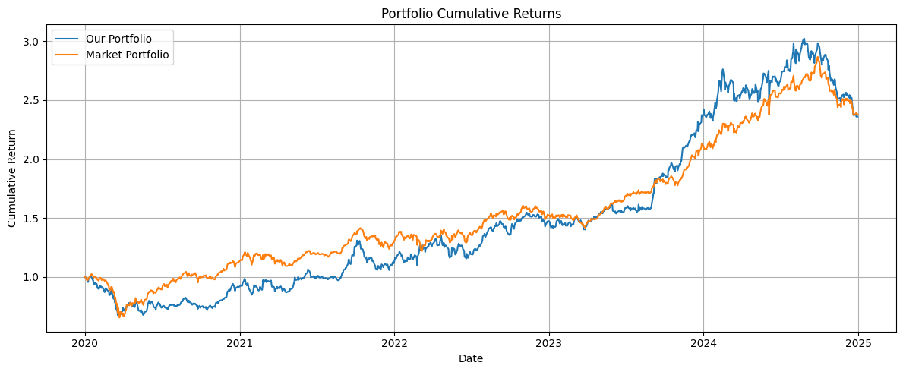

# FinOptix: Machine Learning Stock Selection & Portfolio Optimization

An end-to-end quantitative investment framework that combines **Machine Learning**, **Fundamental Analysis**, and **Modern Portfolio Theory** to automate stock selection and portfolio construction.

The pipeline predicts future stock returns using **XGBoost**, ranks stocks using both technical and fundamental factors, constructs an optimized portfolio using the **Black-Litterman Model** and **Markowitz Mean-Variance Optimization**, and evaluates performance through historical backtesting.

---

##  Highlights

-  Machine Learning based stock return prediction using XGBoost
-  Technical indicator based feature engineering
-  Fundamental factor based stock ranking
-  Portfolio Optimization using Black-Litterman Model
-  Mean-Variance Optimization (Markowitz)
-  Fama-French Three Factor Model integration
-  Historical backtesting with comprehensive risk metrics
-  Performance comparison against benchmark portfolio

---

# Project Pipeline

```text
Historical Market Data
        │
        ▼
Feature Engineering
        │
        ▼
XGBoost Return Prediction
        │
        ▼
Fundamental + ML Stock Ranking
        │
        ▼
Top Stock Selection
        │
        ▼
Black-Litterman Model
        │
        ▼
Mean-Variance Optimization
        │
        ▼
Optimal Portfolio Allocation
        │
        ▼
Historical Backtesting
        │
        ▼
Performance Evaluation
```

---

# Data Collection

- **Universe:** NIFTY 50 Stocks
- **Historical Data:** Yahoo Finance (yFinance API)
- **Training Period:** March 2022 – May 2024
- **Testing Period:** June 2024 – July 2025

Additional fundamental features:

- Price-to-Earnings Ratio (P/E)
- Debt-to-Equity Ratio
- Market Capitalization

---

# Feature Engineering

Technical indicators generated include:

- Daily Returns
- Rolling Volatility
- 10-Day Moving Average
- 50-Day Moving Average
- 10-Day Momentum
- 50-Day Momentum
- Bollinger Bands
- Lagged Returns
- Volume Correlation

These features are used to predict future stock returns.

---

# Machine Learning Model

Each stock is assigned an independent **XGBoost Regression** model.

### Model Parameters

```python
objective = "reg:squarederror"
n_estimators = 2000
learning_rate = 0.01
max_depth = 12
subsample = 0.8
colsample_bytree = 0.8
random_state = 42
```

Evaluation metrics:

- RMSE
- Correlation Coefficient

The predicted returns are later used for portfolio construction.

---

# Stock Ranking Framework

Stocks are scored using a weighted combination of:

- Expected Return (Predicted by XGBoost)
- P/E Ratio
- Debt-to-Equity Ratio
- Market Capitalization

The weighting scheme is user configurable.

The highest ranked stocks are selected for portfolio optimization.

---

## Top Ranked Stocks

<p align="center">

</p>

---

## Fundamental Metric Comparison

<p align="center">

</p>

---

# Portfolio Optimization

After selecting the best-performing stocks, portfolio weights are generated using:

## Mean-Variance Optimization

- Expected Return Maximization
- Risk Minimization
- Efficient Frontier

## Black-Litterman Model

The framework combines

- Market Equilibrium Returns
- Investor Views
- Bayesian Updating

to produce more stable and realistic portfolio allocations.

Optimization objective:

- Maximum Sharpe Ratio

Implemented using **PyPortfolioOpt**.

---

## Portfolio Weight Comparison

<p align="center">

</p>

---

# Backtesting Framework

The optimized portfolio is evaluated using historical data.

The framework computes

- Portfolio Returns
- Benchmark Returns
- Sharpe Ratio
- Sortino Ratio
- Maximum Drawdown
- Average Drawdown
- Trade Statistics
- Holding Period
- Win Rate

Both Long and Short trades are supported.

---

# Results

| Metric | Value |
|---------|-------|
| **Portfolio Return** | **857.79%** |
| **Benchmark Return** | **239.06%** |
| **Sharpe Ratio** | **2.55** |
| **Sortino Ratio** | **3.36** |
| **Maximum Drawdown** | **46.95%** |
| **Average Drawdown** | **25.12%** |
| **Total Trades** | **36** |
| **Long Trades** | **18** |
| **Short Trades** | **18** |
| **Win Rate** | **33.33%** |
| **Average Holding Time** | **32.44 Days** |
| **Maximum Holding Time** | **196 Days** |

---

## Performance Comparison

<p align="center">

</p>

---

# Technologies Used

| Category | Libraries |
|----------|-----------|
| Programming | Python |
| Data Analysis | Pandas, NumPy |
| Machine Learning | XGBoost, Scikit-Learn |
| Portfolio Optimization | PyPortfolioOpt |
| Visualization | Matplotlib |
| Data Source | Yahoo Finance (yFinance) |

---

# Repository Structure

```text
.
├── notebooks/
│   ├── stock_selection.ipynb
│   ├── portfolio_optimization.ipynb
│
├── reports/
│   ├── efficient_stock_selection_report.pdf
│
├── images/
│   ├── top_stocks.png
│   ├── fundamental_scores.png
│   ├── portfolio_weights.png
│   ├── cumulative_returns.png
│
├── README.md
└── requirements.txt
```

---

# Future Improvements

- Live portfolio rebalancing
- Transaction cost modelling
- Slippage simulation
- Sentiment Analysis from News
- Macroeconomic indicators
- Transformer/LSTM based forecasting
- Reinforcement Learning based portfolio allocation

---

# Key Takeaways

- Machine Learning effectively identifies stocks with strong return potential.
- Combining technical indicators with company fundamentals improves stock selection.
- Black-Litterman generates more robust portfolio weights than traditional optimization.
- Historical backtesting demonstrates superior returns over the benchmark while maintaining strong risk-adjusted performance.

---

# References

- Harry Markowitz — Modern Portfolio Theory
- Black-Litterman Portfolio Model
- Fama-French Three-Factor Model
- XGBoost Documentation
- PyPortfolioOpt
- Yahoo Finance API

---
